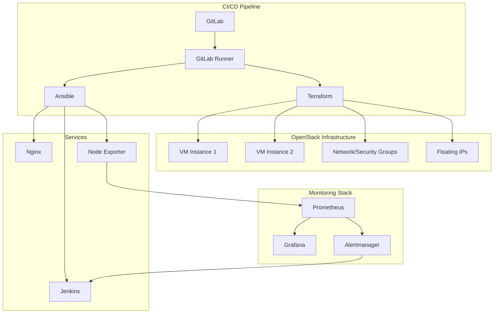

# OpenStack 기반 Private Cloud 운영 자동화 시스템

## 프로젝트 개요

이 프로젝트는 OpenStack(DevStack) 환경 위에 구축된 멀티 테넌트 클라우드 운영 자동화 시스템이다. 인프라 생성부터 서비스 배포, 모니터링, 장애 대응까지 전체 라이프사이클을 자동화하는 것을 목표로 한다.

### 주요 특징

- **Infra as Code (IaC)**: Terraform으로 VM, 네트워크, 스토리지 자동 관리
- **Configuration Management**: Ansible로 서비스 설치 및 초기 설정 자동화
- **CI/CD**: GitLab + Runner, Jenkins로 지속적 통합 및 배포 파이프라인 구성
- **Monitoring & Alerting**: Prometheus + Grafana + Alertmanager로 상태 수집/시각화/알람
- **Auto-Recovery**: Alertmanager 웹훅 → Jenkins → 자동 복구 스크립트 실행

## 프로젝트 단계

### Phase 1: 기반 환경 구성
- Ubuntu 서버에 DevStack 설치 (All-in-One)
- 기본 프로젝트/사용자/네트워크 설정

### Phase 2: 인프라 자동화
- Terraform으로 VM 인스턴스, 네트워크, 보안 그룹, 스토리지 생성
- Terraform state 파일 기반 버전 관리

### Phase 3: 서비스 구성 자동화
- Ansible 플레이북으로 서비스 자동 배포
- Nginx, Jenkins, Node Exporter 설치 및 초기 설정

### Phase 4: CI/CD 파이프라인 구축
- GitLab 저장소 생성, Runner 등록
- `.gitlab-ci.yml` 작성 → Terraform/Ansible Job 자동화
- 브랜치 전략(dev → main) 기반 파이프라인 실행

### Phase 5: 모니터링 시스템 구성
- Prometheus 서버로 메트릭 수집
- Grafana 대시보드로 시각화
- Alertmanager로 알람 전달 (Slack/Email 연동 가능)

### Phase 6: 장애 대응 및 문서화
- Jenkins `load-test` Job으로 부하/장애 시나리오 주입
- Prometheus 규칙 기반 장애 탐지
- Alertmanager 웹훅 → Jenkins `auto-recover` Job 실행 → 자동 복구
- 장애 대응 절차 문서화

## 프로젝트 구조

```
openstack-automation/
├── ansible/
│   ├── playbooks/
│   │   ├── hosts-fix.yml
│   │   ├── inventory.yml
│   │   ├── jenkins-install.yml
│   │   ├── nginx-install.yml
│   │   └── node-exporter.yml
├── terraform/
│   ├── main.tf
│   ├── output.tf
│   ├── providers.tf
│   └── variables.tf
├── gitlab-ci/
│   ├── .gitlab-ci.yml
│   └── runners/
│       ├── .terraform.ci.yml
│       ├── .ansible.ci.yml
│       ├── .terraform+ansible+monitoring.ci.yml
│       └── .test.yml
├── scripts/
│   └── (custom scripts)
├── docs/
│   ├── architecture/
│   │   └── system-overview.md
│   ├── operations/
│   │   ├── daily-checklist.md
│   │   └── backup-procedures.md
│   └── Phase/
│       ├── Phase1/
│       ├── Phase2/
│       ├── Phase3/
│       ├── Phase4/
│       ├── Phase5/
│       └── Phase6/
└── README.md
```

## 시스템 요구사항

### 하드웨어 (개인 가상환경 기준)

| 구성요소 | 최소 요구사항 | 용도 |
|----------|---------------|------|
| **CPU** | 8 vCPU | 전체 시스템 |
| **RAM** | 16GB 이상 | DevStack: 8GB<br>모니터링 스택: 4GB<br>여유분: 4GB |
| **스토리지** | SSD 120GB 이상 | OS: 40GB<br>OpenStack: 80GB |
| **네트워크** | 유선 인터넷 권장 | 대용량 패키지 다운로드 |

### 소프트웨어

- VMware Workstation Pro
- Ubuntu 22.04.5 LTS
- Git 2.30 이상
- Python 3.8 이상

## 기술 스택

### Infrastructure & Platform
- **클라우드 플랫폼**: OpenStack (DevStack)
- **가상화**: VMware Workstation Pro

### DevOps Tools
- **IaC**: Terraform
- **구성 관리**: Ansible
- **CI/CD**: GitLab, Jenkins
- **서비스**: Nginx

### Monitoring Stack
- **메트릭 수집**: Prometheus
- **시각화**: Grafana
- **알람 관리**: Alertmanager
- **테스트/부하 도구**: ApacheBench (ab)

## 시스템 동작 흐름

### 1. Provisioning
Terraform으로 OpenStack 자원 자동 생성 (VM, 네트워크, 보안 그룹, Floating IP 등)

### 2. Configuration
Ansible로 VM 내부 서비스 설치 및 초기 설정 (Nginx, Jenkins, Node Exporter 등)

### 3. CI/CD
- GitLab + Runner로 코드 변경 시 Terraform/Ansible 자동 실행
- Jenkins는 부하 테스트 및 장애 복구 스크립트 실행 담당

### 4. Monitoring
- Prometheus로 지표 수집, Grafana로 시각화
- Alertmanager로 알람 관리

### 5. Failure & Recovery
1. 장애 발생 (서비스 다운, 포트 차단, CPU 스파이크 등)
2. Prometheus 규칙 → Alertmanager → Jenkins 웹훅
3. 자동 복구 스크립트 실행
4. 정상화 후 알람 RESOLVED

## 아키텍처 다이어그램



## 시작하기

### 1. 저장소 클론

```bash
git clone https://github.com/your-username/openstack-automation.git
cd openstack-automation
```

### 2. 환경 설정

```bash
# OpenStack 환경 변수 설정
source openrc

# Terraform 초기화
cd terraform
terraform init
```

### 3. 인프라 배포

```bash
# Terraform으로 인프라 생성
terraform plan
terraform apply

# Ansible로 서비스 배포
cd ../ansible
ansible-playbook -i inventory.yml site.yml
```

## 문서

- [`docs/architecture/system-overview.md`](docs/architecture/system-overview.md): 전체 시스템 구성도
- [`docs/operations/daily-checklist.md`](docs/operations/daily-checklist.md): 일일 운영 점검 항목
- [`docs/operations/backup-procedures.md`](docs/operations/backup-procedures.md): 백업/복구 절차
- [`docs/Phase/*`](docs/Phase/): 각 Phase별 진행 기록 및 상세 설명

## 트러블슈팅

일반적인 문제 해결 방법은 다음 문서를 참조한다:

- [Phase 6-1: 트래픽 생성 및 장애 주입](docs/Phase/Phase6/phase6-1-traffic-load-fault-injection.md)
- [Phase 6-2: 자동 탐지 및 복구](docs/Phase/Phase6/phase6-2-automated-detection-recovery.md)

## 기여하기

1. 이 저장소를 Fork한다
2. Feature 브랜치를 생성한다 (`git checkout -b feature/new-feature`)
3. 변경사항을 커밋한다 (`git commit -am 'Add new feature'`)
4. 브랜치에 Push한다 (`git push origin feature/new-feature`)
5. Pull Request를 생성한다

## 라이선스

이 프로젝트는 MIT 라이선스 하에 배포된다. 자세한 내용은 [LICENSE](LICENSE) 파일을 참조한다.

## 결론

이 프로젝트는 클라우드 인프라 운영의 모든 단계(생성 → 배포 → 모니터링 → 복구)를 자동화했다. 포트폴리오 및 실무 레퍼런스로 활용 가능하며, DevOps/CloudOps 엔지니어 역량을 종합적으로 증명할 수 있는 사례이다.
